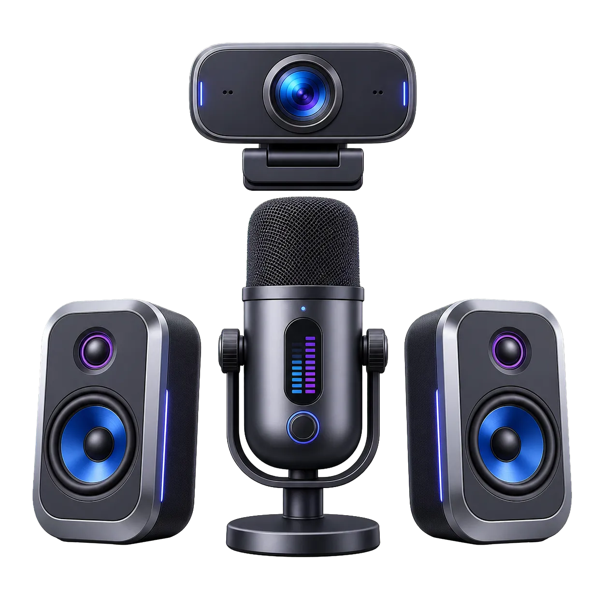

# Camera, Microphone & Speaker Tester

Test selected cameras, microphones, and speakers with live previews, input levels, sample playback, and stereo tones.

## Features

- Separate camera and microphone start controls, so only the hardware being tested is activated
- Live preview for the selected camera with switching between available video devices
- Real-time microphone level meter for checking input sensitivity and activity
- Automatic microphone sample recording with playback, stop, and discard controls
- Left-channel, right-channel, and stereo speaker test tones
- Output-device selection where the browser supports speaker routing
- Persistent on-screen hardware status plus one-click cleanup of every active media track and audio resource

## Screenshot



## How to use

1. Open the Camera, Microphone, or Speakers panel for the hardware you want to check.
2. Start the camera or microphone and approve only the permission requested by the browser.
3. Select a device, then watch the camera preview or microphone level and replay the automatically recorded sample.
4. Choose an output device when available and play the left, stereo, and right test tones.
5. Stop each test individually or use Stop all hardware to release every active device.

## Browser support and limitations

The current stable releases of Chromium, Firefox, and Safari are supported.

- Camera and microphone tests require HTTPS or localhost and explicit browser permission.
- Selecting a specific speaker is not supported by every browser; channel test tones still use the active system output.
- Another application using a device exclusively may prevent that device from starting.

## Run locally

Requirements:

- Node.js 24.x
- Corepack

```bash
corepack enable
pnpm install --frozen-lockfile
pnpm run dev
```

## Verify

Fast checks:

```bash
pnpm run check
```

Complete browser verification:

```bash
pnpm run verify
```

## Build and host

```bash
pnpm run build
```

Upload the contents of `dist/` to a static host. The application supports both
root and subdirectory hosting and needs no environment variables.

The same output can be deployed with GitHub Pages, Netlify, Cloudflare Pages,
Vercel static hosting, or an ordinary file upload.

## Data and network behaviour

The application ships without analytics or telemetry. Tool processing occurs
in the browser, and the primary browser tests fail unexpected external
requests. See [PRIVACY.md](./PRIVACY.md) for the storage and browser API
inventory.

## Contributing

Issues and pull requests are welcome. Read
[CONTRIBUTING.md](./CONTRIBUTING.md) before submitting a change.

## Credits

Created by M. Jibulu for [eBURP](https://eburp.com/).

## Licence

Original code is available under the [MIT Licence](./LICENSE). Dependencies and
assets retain their own licences; see
[THIRD_PARTY_NOTICES.md](./THIRD_PARTY_NOTICES.md).
